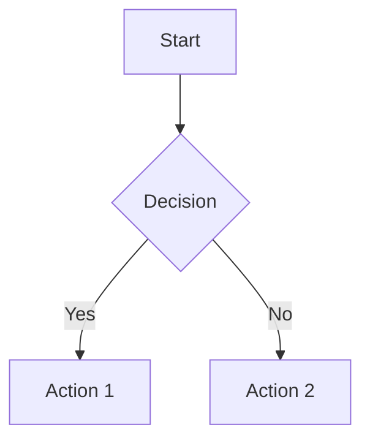

# Advanced Features

Explore advanced capabilities and customization options for your documentation site.

## Custom Styling

### Theme Customization

You can customize the appearance by modifying CSS variables in the theme files:

```css
/* In src/index.css for light theme */
:root {
    --bg-primary: #f5f5f5;
    --text-primary: #333333;
    --accent-primary: #005566;
    /* Add your custom colors */
}
```

### Adding Custom CSS

Create additional CSS files and import them:

```html
<!-- In index.html -->
<link rel="stylesheet" href="src/custom.css">
```

### Custom Components

Add custom HTML components to your Markdown:

```html
<div class="callout info">
    <strong>Info:</strong> This is an information callout.
</div>
```

Then style them in your CSS:

```css
.callout {
    padding: 1rem;
    border-radius: 4px;
    margin: 1rem 0;
}

.callout.info {
    background-color: #e3f2fd;
    border-left: 4px solid #2196f3;
}
```

## Advanced Navigation

### Nested Categories

Create deeply nested navigation structures:

```json
{
  "title": "API Reference",
  "items": [
    {
      "title": "Authentication",
      "path": "docs/api/auth/overview.md",
      "children": [
        {
          "title": "OAuth 2.0",
          "path": "docs/api/auth/oauth.md"
        },
        {
          "title": "API Keys",
          "path": "docs/api/auth/api-keys.md"
        }
      ]
    }
  ]
}
```

### External Links

Add external links to your navigation:

```json
{
  "title": "Resources",
  "items": [
    {
      "title": "GitHub Repository",
      "url": "https://github.com/username/repo",
      "external": true
    }
  ]
}
```

## Enhanced Search

### Search Configuration

Customize search behavior by modifying the search index building:

```javascript
// In src/app.js, modify buildSearchIndex method
buildSearchIndex() {
    this.searchIndex = [];
    this.navigation.forEach(section => {
        section.items.forEach(item => {
            this.searchIndex.push({
                title: item.title,
                path: item.path,
                section: section.title,
                keywords: item.keywords || [] // Add custom keywords
            });
        });
    });
}
```

### Search Highlighting

Add search term highlighting in results:

```javascript
renderSearchResults(results, container, query) {
    // Highlight matching terms
    const highlightText = (text, query) => {
        const regex = new RegExp(`(${query})`, 'gi');
        return text.replace(regex, '<mark>$1</mark>');
    };
    
    // Use in result rendering
    div.innerHTML = `<strong>${highlightText(result.title, query)}</strong>`;
}
```

## Content Enhancement

### Code Syntax Highlighting

Add syntax highlighting with Prism.js:

```html
<!-- Add to index.html -->
<link href="https://cdnjs.cloudflare.com/ajax/libs/prism/1.29.0/themes/prism.min.css" rel="stylesheet">
<script src="https://cdnjs.cloudflare.com/ajax/libs/prism/1.29.0/prism.min.js"></script>
<script src="https://cdnjs.cloudflare.com/ajax/libs/prism/1.29.0/components/prism-javascript.min.js"></script>
```

### Mermaid Diagrams

Add diagram support with Mermaid:

```html
<script src="https://cdn.jsdelivr.net/npm/mermaid@10.6.1/dist/mermaid.min.js"></script>
```

Then use in Markdown:

````markdown

````

### Math Expressions

Add MathJax for mathematical expressions:

```html
<script src="https://polyfill.io/v3/polyfill.min.js?features=es6"></script>
<script id="MathJax-script" async src="https://cdn.jsdelivr.net/npm/mathjax@3/es5/tex-mml-chtml.js"></script>
```

Use in Markdown:
```markdown
Inline math: $E = mc^2$

Block math:
$$
\int_{-\infty}^{\infty} e^{-x^2} dx = \sqrt{\pi}
$$
```

## Performance Optimization

### Lazy Loading

Implement lazy loading for large documentation sets:

```javascript
async loadDoc(path) {
    // Show loading state
    const content = document.getElementById('content');
    content.innerHTML = '<div class="loading">Loading...</div>';
    
    // Implement caching strategy
    if (this.docs.has(path)) {
        this.renderDoc(this.docs.get(path));
        return;
    }
    
    // Load and cache
    try {
        const response = await fetch(path);
        const docContent = await response.text();
        this.docs.set(path, docContent);
        this.renderDoc(docContent);
    } catch (error) {
        this.showError(error, path);
    }
}
```

### Image Optimization

Optimize images for web:

```markdown
<!-- Use appropriate image formats -->


<!-- Provide multiple sizes -->
<picture>
  <source media="(max-width: 768px)" srcset="images/mobile.webp">
  <source media="(min-width: 769px)" srcset="images/desktop.webp">
  
</picture>
```

## Analytics and Tracking

### Google Analytics

Add tracking to monitor usage:

```html
<!-- Google Analytics -->
<script async src="https://www.googletagmanager.com/gtag/js?id=GA_MEASUREMENT_ID"></script>
<script>
  window.dataLayer = window.dataLayer || [];
  function gtag(){dataLayer.push(arguments);}
  gtag('js', new Date());
  gtag('config', 'GA_MEASUREMENT_ID');
</script>
```

### Custom Events

Track user interactions:

```javascript
// Track page views
loadDoc(path) {
    // ... existing code ...
    
    // Track page view
    if (typeof gtag !== 'undefined') {
        gtag('event', 'page_view', {
            page_title: this.getPageTitle(path),
            page_location: window.location.href
        });
    }
}

// Track search usage
performSearch(query) {
    // ... search logic ...
    
    if (typeof gtag !== 'undefined') {
        gtag('event', 'search', {
            search_term: query
        });
    }
}
```

## Accessibility Improvements

### Keyboard Navigation

Enhance keyboard accessibility:

```javascript
setupKeyboardNavigation() {
    document.addEventListener('keydown', (e) => {
        // Navigate with arrow keys
        if (e.key === 'ArrowUp' || e.key === 'ArrowDown') {
            this.navigateWithKeyboard(e.key);
        }
        
        // Focus search with '/'
        if (e.key === '/' && !e.target.matches('input')) {
            e.preventDefault();
            document.getElementById('search-input').focus();
        }
    });
}
```

### Screen Reader Support

Add ARIA labels and roles:

```html
<nav class="sidebar" role="navigation" aria-label="Documentation navigation">
    <div class="search-container">
        <input type="text" 
               id="search-input" 
               placeholder="Search docs..."
               aria-label="Search documentation"
               role="searchbox">
    </div>
</nav>
```

## Deployment Automation

### GitHub Actions

Automate deployment with GitHub Actions:

```yaml
# .github/workflows/deploy.yml
name: Deploy Documentation

on:
  push:
    branches: [ main ]

jobs:
  deploy:
    runs-on: ubuntu-latest
    steps:
    - uses: actions/checkout@v3
    
    - name: Deploy to GitHub Pages
      uses: peaceiris/actions-gh-pages@v3
      with:
        github_token: ${{ secrets.GITHUB_TOKEN }}
        publish_dir: ./
```

### Build Process

Add a build step for optimization:

```json
{
  "scripts": {
    "build": "node build.js",
    "deploy": "npm run build && gh-pages -d dist"
  }
}
```

## Next Steps

- Explore the [API Reference](../api/overview.md)
- Learn about [Authentication](../api/authentication.md)
- Check out community examples and templates